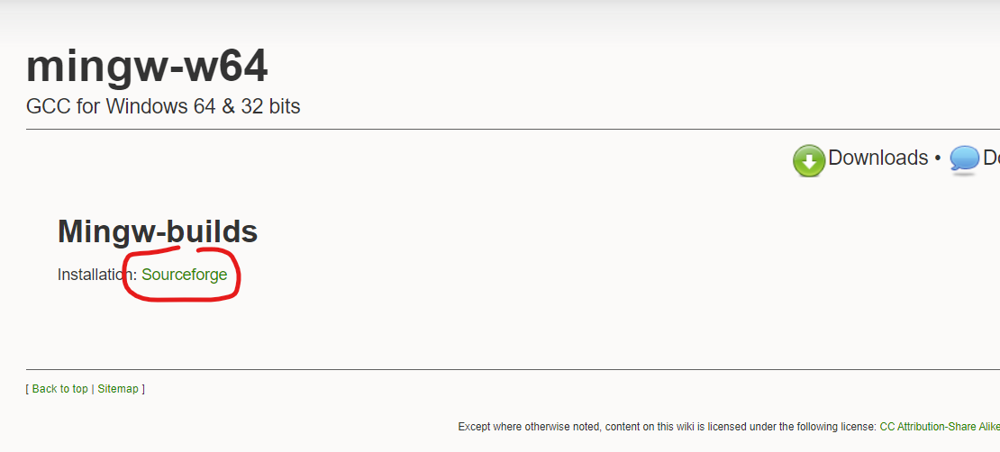
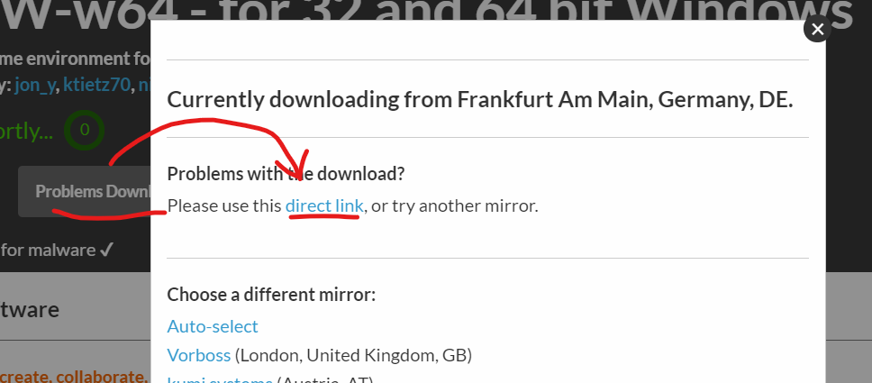
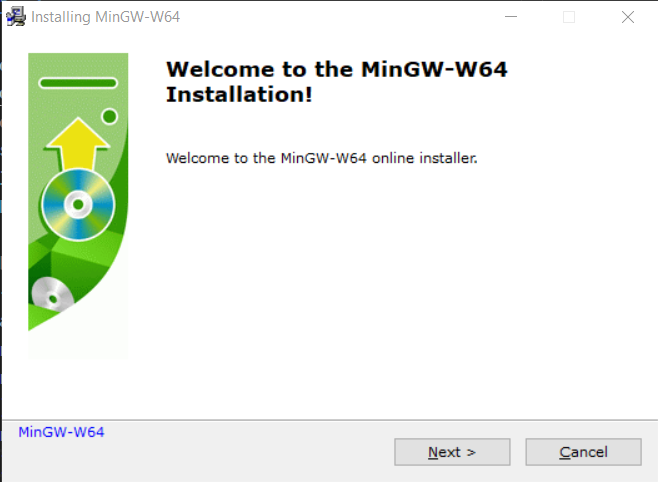
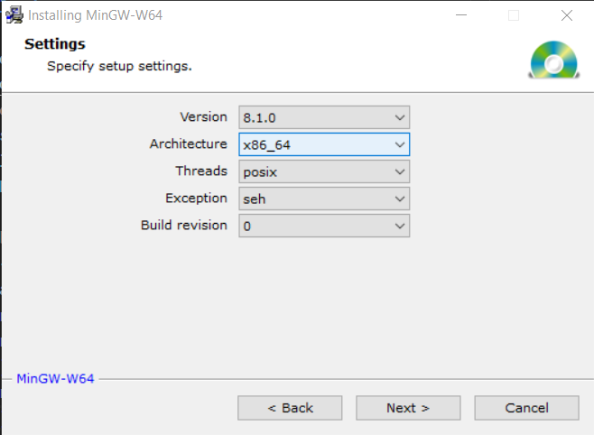
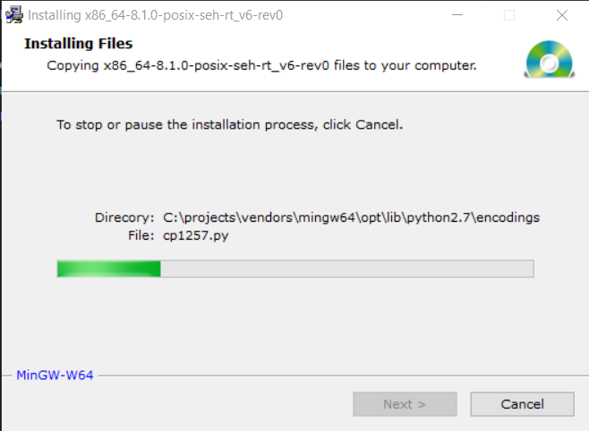
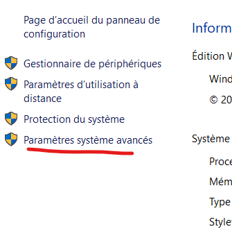
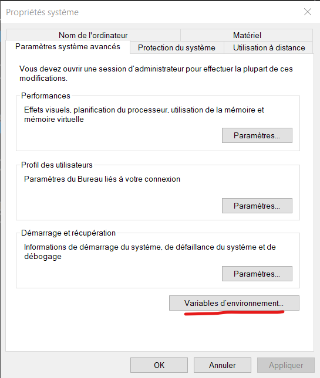
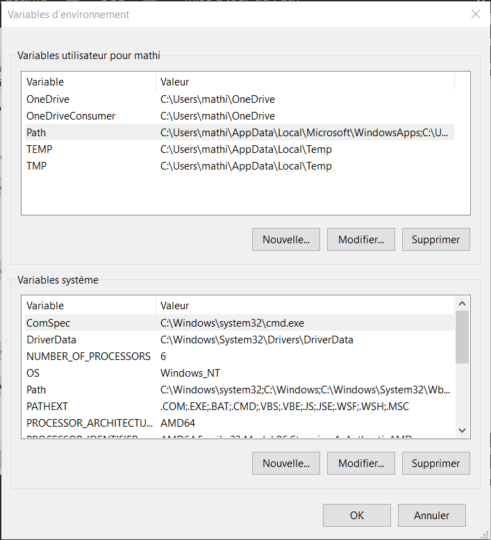
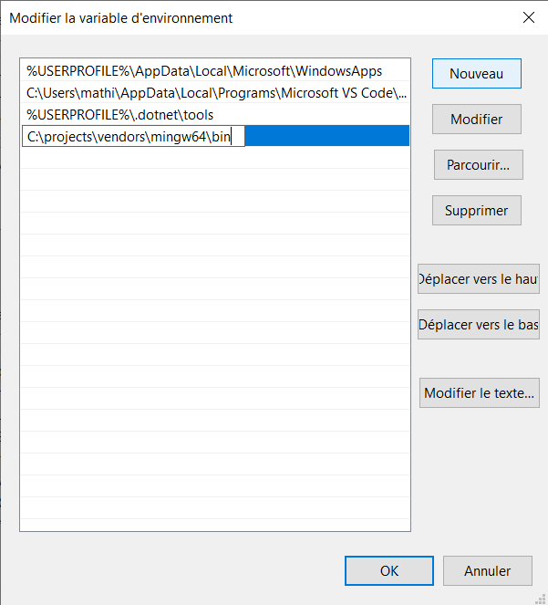

# GCC/G++

## Présentation

Voir le cours :
+ [Introduction au C.pptx](../02_C/01_Introduction/Introduction_au_C.pptx)
+ [01_hello.md](../02_C/01_Introduction/01_hello.md)

## Installation

1) Se rendre sur le site http://mingw-w64.org/doku.php/download/mingw-builds et cliquer sur Sourceforge

2) Enregister le fichier sur votre pc
    + Si le téléchargement ne démarre pas, cliquer sur "Problems Downloading?" puis sur "Direct link"
    
3) Double-cliquer sur l'installeur téléchargé (L'utilisateur doit posséder les droits d'admnistration du pc)
4) Cliquer sur "Next >"

5) Changer la valeur d'"Architecture" pour "x86_64" et cliquer sur "Next >"

6) Changer la valeur du "Destination folder" pour "C:\projects\vendors" (dossier à créer au prélable) et cliquer sur "Next >"

7) Le téléchargement puis l'installation des compilateurs peuvent prendre un certain temps...

8) Cliquer sur "Next >"
9) Cliquer sur "Finish"

## Mise à jour du Path

1) Copier le chemin d'accès au dossier "bin" situé dans le répertoire d'installation de MinGW-W64
2) Ouvrir Panneau de configuration > Système (cliquer sur l'icône Windows et taper "système")
3) Cliquer sur "Paramètres système avancés" dans la partie de gauche

4) Cliquer sur "Variables d'environnement..." en bas de la fenêtre

5) Modifier ou, si elle est absente, créer la variable d'utilisateur "Path" (partie du haut de la fenêtre)

    + Créer la variable en cliquant dans la partie du haut sur "Nouvelle..." puis, dans la fenêtre qui s'ouvre, saisir "Path" comme "Nom de la variable" et coller le chemin d'accès au dossier "bin", finalement, cliquer sur "OK"
    
    + Modifier la valeur du Path en la sélectionnant dans la liste de la partie du haut, puis en cliquant sur "Modifier...", dans la fenêtre qui s'ouvre, cliquer sur "Nouveau", coller le chemin d'accès au dossier "bin", finalement, cliquer sur "OK"
    
6) Cliquer sur "OK" dans la fenêtre "Variables d'environnement pour entériner le changement.
7) Fermer les autres fenêtres
8) Ouvrir une invite de commande (DOS) et saisir la commande suivante pour valider l'installation :
```
gcc --version
```
