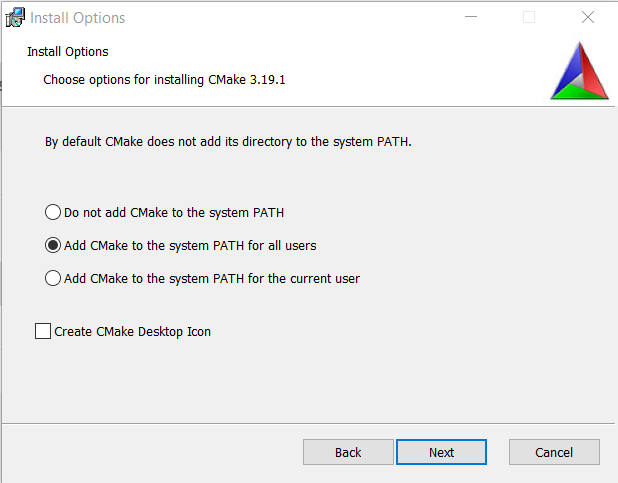

# CMake

## Installation

### Installation de CMake

1. Télécharger la dernière version de CMake à cette adresse : https://cmake.org/download/, choisir le binaire correspondant à la plateforme cible :
 
2. Lancer l'installeur téléchargé et cliquer sur "Next"
 
3. Accepter la licence et cliquer sur "Next"
 
4. Choisir l'option "Add CMake to system PATH for all users" et cliquer sur "Next"
 
5. Cliquer sur "Change" et naviguer jusqu'au dossier "C:\projects\vendors\cmake\" (créer les dossier manquants si nécessaire) :
 
6. Cliquer sur "Install"
 
7. Patienter pendant l'installation puis cliquer sur "Finish"
 

### Installation du plugin VSCode

1. Ouvrir VSCode
2. Aller dans la zone des "Extensions"
 
3. Saisir "cmake tools" dans la zone de recherche, sélectionner le plugin éponyme de Microsoft et cliquer sur "Install"
 

## Utilisation

...