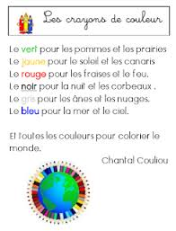

# Challenge programmation

## Challenge 1

Répondre au défi suivant : [Teleporteurs](https://atcoder.jp/contests/abc167/tasks/abc167_d)

## Challenge 2

1. Créer une classe ```Clock``` qui affiche dans la console l'heure du système au format hh:mm:ss.
2. Créer un programme qui utlise la classe ```Clock``` et affiche l'heure dans la console et la rafraichît toutes les secondes en remplaçant la valeur précédente.

## Challenge 3

Ecrire le poème ci-dessous dans la console avec les couleurs :

