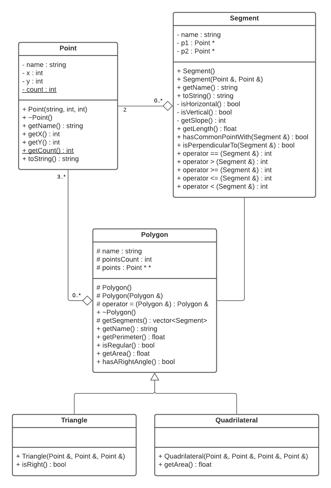

# BTS 2 - TP 2 - POO et C++

Réaliser les exercices directement dans le dossier 99_Devoirs/bts2_tp_2

Compiler dans le dossier à l'aide de g++ *.cpp

>NB. Les méthodes à définir dans les exercices ont été "bouchonnées" de manière à ce que le programme initial compile.

## Exercice 1 - Affichage des points créés

Dans le programme principal, ajouter un ```vector``` de Point pour stocker chacun des points après leur création, puis les afficher dans la console à l'aide de la méthode ```toString()``` au niveau de du commentaire "Exercice 1 - Affichage des points créés".

## Exercice 2 - Longueur

Dans la classe ```Segment```, définir la méthode ```float getLength();``` qui renvoie la longueur d'un segment à partir des coordonnées de ses points.

> Indice 1 : Pythagore...
> Indice 2 : Des fonctions de la bibliothèque ```math.h``` peuvent être utiles.

## Exercice 3 - Points en commun

Dans la classe ```Segment```, définir la méthode ```bool hasCommonPointWith(Segment &);``` qui renvoie ```true``` si le segment partage un point en commun avec le segment passé en argument, ```false```dans le cas contraire.

## Exercice 4 - Perpendicularité

Dans la classe ```Segment```, définir la méthode ```bool isPerpendicularTo(Segment &);``` qui renvoie ```true``` si le segment est perpendiculaire au segment passé en argument, ```false```dans le cas contraire.

> Deux segments sont perpendiculaires si leurs pentes respectives ```m1``` et ```m2``` respectent l'égalité suivante : ```m1 = -1 / m2```. La pente est donnée par la méthode ```getSlope()```.

## Exercice 5 - Différent de

Dans la classe ```Segment```, définir la méthode ```int operator != (Segment &);``` sans accéder aux points du segment.

> Rappel : Un segment est égal à un autre s’ils relient les mêmes points.

## Exercice 6 - Héritage



Mettre en place l'héritage des classes ```Triangle``` et ```Quadrilateral``` avec la classe ```Polygon``` :

1. Modifier les fichiers ```Triangle.h``` et ```Quadrilateral.h``` pour qu'ils correspondent à l'implémentation attendue dans le diagramme de classe ci-dessus.

2. Implémenter les constructeurs de ```Triangle``` et ```Quadrilateral``` pour qu'ils initialisent les attributs de Polygon en respectant les règles suivantes :
    + « name » : le nom du polygone créé à partir du nom des points le constituant dans l’ordre de déclaration (ex : un polygone reliant les points « A », « B », « E » et « C »  sera nommé « ABEC »).
    + « pointsCount » : le nombre de points constituant le polygone.
    + « points » : un tableau de pointeurs sur les points constituant le polygone.

3. Dans la classe ```Triangle```, implémenter la méthode ```isRight()```comme suit et la commenter :
```cpp
bool isRight() {
    return hasARightAngle();
}
```

4. Dans la classe ```Quadrilateral```, implémenter la méthode ```getArea()```comme suit et expliquer ses limites (pour quel type de quadrilatère fonctionne-t-elle) en la commentant :
```cpp
float getArea() {
    if (isRegular() && hasARightAngle()) {
        float length = Segment(*points[0], *points[1]).getLength();
        return length * length;
    }
    return 0;
}
```
       
5. Décommenter la dernière partie du main pour vérifier votre implémentation.

6. A la fin du main, implémenter une comparaison des résultats des méthodes getArea() de ```Polygon``` et de ```Quadrilateral``` pour le ```Quadrilateral abec```.